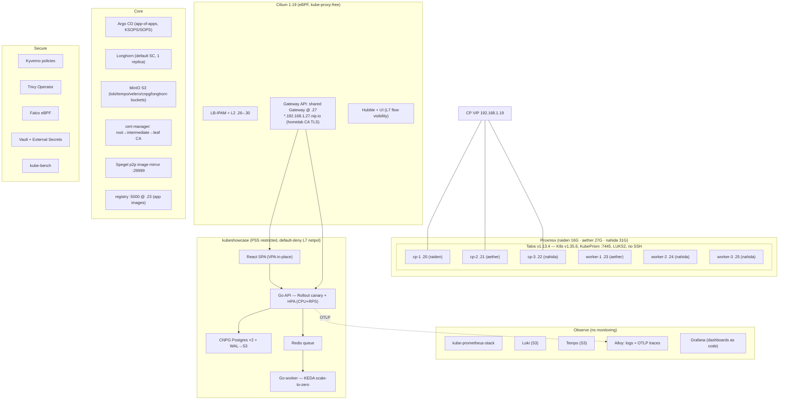

# KubeShowcase — a production-grade Talos Linux platform on a shared homelab

A complete, GitOps-driven Kubernetes platform on **Talos Linux v1.13.4** (API-only, immutable,
SSH-less) across 6 VMs on a 3-node Proxmox cluster, reconciled end-to-end by **Argo CD** from
this repo, carrying a full LGTM observability stack, a security/governance tier, and a
multi-tier demo app exercising every autoscaler and workload primitive Kubernetes has.

> **Hardware honesty:** the original 48–72 GiB plan did not survive contact with reality
> (~29 GiB free across the Proxmox hosts, which also run a busy co-tenant k0s cluster + HA + PBS).
> It started at ~22.5 GiB of new VMs and **grew to 40 GiB / 30 vCPU** after real incidents proved
> the control plane needed etcd headroom (see the *Resilience Report*). Single-replica
> observability, Longhorn `numberOfReplicas=1`, documented Stretch-tier triage. See *Resource budget*.

## Architecture

## Service access

DNS-free by design: `*.192.168.1.27.nip.io` resolves to the shared Gateway (192.168.1.27).
All HTTPS, certs issued by the **KubeShowcase intermediate CA**.

| Service | URL | Auth |
|---|---|---|
| KubeShowcase app | https://app.192.168.1.27.nip.io | none |
| Argo CD | https://argocd.192.168.1.27.nip.io | `admin` / `kubectl -n argocd get secret argocd-initial-admin-secret -o jsonpath='{.data.password}' \| base64 -d` |
| Grafana | https://grafana.192.168.1.27.nip.io | `admin` / SOPS: `sops -d observability/manifests/grafana-admin.sops.yaml` |
| Hubble UI | https://hubble.192.168.1.27.nip.io | none |
| Longhorn | https://longhorn.192.168.1.27.nip.io | none |
| MinIO console | https://minio.192.168.1.27.nip.io | SOPS: `sops -d platform/minio/manifests/minio-root.sops.yaml` |
| Vault | https://vault.192.168.1.27.nip.io | root token from `security/vault/seed-vault.sh` init output |
| Goldilocks | https://goldilocks.192.168.1.27.nip.io | none |

**Trust the CA once:** `kubectl -n cert-manager get secret homelab-root-ca -o jsonpath='{.data.tls\.crt}' | base64 -d > root-ca.crt`
then add to your trust store (macOS: `sudo security add-trusted-cert -d -k /Library/Keychains/System.keychain root-ca.crt`).

## Repo layout / tiers

| Path | Tier | Contents |
|---|---|---|
| `talos/` | Core | factory schematic (ID committed), machine patches, SOPS-encrypted secrets bundle |
| `bootstrap/` | Core | `01-bootstrap-core.sh` (Gateway API CRDs + Cilium), `02-bootstrap-argocd.sh` (Argo CD + age key + root app) — the ONLY imperative steps |
| `platform/` | Core | cilium, gateway, cert-manager CA chain, longhorn, minio, spegel, metrics-server, registry, velero, argocd config |
| `observability/` | Observe | kube-prometheus-stack, loki, tempo, alloy, prometheus-adapter, dashboards (JSON as ConfigMaps), PrometheusRules |
| `security/` | Secure | kyverno policies, trivy, falco, vault (+seed script), ESO store, kube-bench, PSS rationale |
| `apps/` | — | Argo CD Application definitions only (root recurses this dir) |
| `workloads/kubeshowcase/` | App | every manifest of the demo app |
| `app-src/` | App | Go API, Go worker, React frontend, pgdump image |
| `load-and-chaos/` | Stretch | k6 profile + Job, build script, chaos/DR runbooks |

## Reproduce from scratch

1. **Phase 0 — image:** schematic in `talos/schematic.yaml` (ID `7d1fa2e0…2a092`: iscsi-tools,
   util-linux-tools, qemu-guest-agent, intel-ucode). Download ISO to each Proxmox node's
   `local` storage via `download-url` API.
2. **VMs:** 6× q35/virtio VMs (IDs 220–225 ↔ IPs .20–.25), `cpu=host`, boot order disk→ISO.
   Sizing: **CPs 4c/8G/40G** (cp-1 capped at 6G — raiden is a 16G host shared with k0s);
   workers 6c/4–5G/70G. One CP per Proxmox host (quorum survives
   any single host failure).
3. **Talos:** `talosctl gen config kubeshowcase https://192.168.1.19:6443 --with-secrets <(sops -d talos/secrets.sops.yaml) --kubernetes-version 1.35.6 --config-patch @talos/patches/common.yaml --config-patch-control-plane @talos/patches/cluster.yaml`
   then per node `talosctl apply-config --insecure -n <dhcp-ip> -f <role>.yaml --config-patch @talos/patches/nodes/<node>.yaml`
   (map maintenance nodes to roles by MAC — `talosctl get hardwareaddresses --insecure`).
   `talosctl bootstrap -n 192.168.1.20` (retry until accepted) → `talosctl kubeconfig`.
4. **Core:** `./bootstrap/01-bootstrap-core.sh` (Gateway API CRDs incl. the TLSRoute/Cilium
   workaround, Cilium, LB-IPAM) → `./bootstrap/02-bootstrap-argocd.sh` (needs the age key at
   `~/.config/sops/age/keys.txt`). Argo CD then converges every tier from Git, in sync-wave order.
5. **Images:** `./load-and-chaos/build-and-push.sh 1.0.0` (local docker build → crane push to
   the in-cluster registry at .23).
6. **Vault (one-time):** `./security/vault/seed-vault.sh` — init/unseal, kv `kubeshowcase/api`,
   Kubernetes auth role for ESO.

Everything else — observability, security, the app — arrives via Argo CD with **no kubectl**.

## Resource budget (actuals)

Final VM allocation: **40 GiB / 30 vCPU** — grown from the planned 22.5 GiB through the
incident-driven RAM bumps (control plane needed real headroom for etcd; see Resilience Report
Incident 1). One CP per Proxmox host so no single host failure can take 2 etcd members.

| VM | Role | Host | vCPU | RAM | Notes |
|---|---|---|---|---|---|
| cp-1 | control plane | raiden | 4 | 6 GiB | capped — raiden is a 16 GiB host shared with k0s |
| cp-2 | control plane | aether | 4 | 8 GiB | |
| cp-3 | control plane | nahida | 4 | 8 GiB | |
| worker-1 | worker | aether | 6 | 8 GiB | hosts registry + Gateway L2 announcer (the reliable node) |
| worker-2 | worker | nahida | 6 | 5 GiB | |
| worker-3 | worker | nahida | 6 | 5 GiB | |

**Measured steady-state** (`kubectl top`, ~15 h soak):
- Control plane: cp-1 3.7 GiB (69%), cp-2 4.0 GiB (55%), cp-3 4.1 GiB (56%) — etcd + apiserver
  static pods dominate; the headroom over the old 2.5 GiB is what keeps etcd off the OOM/thrash cliff.
- Workers: worker-1 3.7 GiB (49%), worker-3 3.0 GiB (68%).
- Per-tier RAM: kube-system ≈ 8.6 GiB (Cilium ×6 + Envoy ×6 + etcd/apiserver static pods),
  monitoring ≈ 2.1 GiB (Prometheus+Loki+Tempo+Grafana+Alloy), Longhorn ≈ 0.8 GiB,
  Falco ≈ 0.47 GiB, the **whole KubeShowcase app ≈ 0.18 GiB**, Argo CD ≈ 0.13 GiB.

> The platform overhead (CNI, observability, storage, security) dwarfs the demo app — which is
> the honest reality of a "showpiece" cluster: you are paying for the *platform*, not the workload.

## Feature matrix

See [docs/feature-matrix.md](docs/feature-matrix.md) — one row per demonstrated feature with
file path + how to observe it.

## Reports

- [docs/talos-gotchas.md](docs/talos-gotchas.md) — every real failure we hit and the fix
- [docs/resilience-report.md](docs/resilience-report.md) — load, chaos, DR, upgrade timelines
- `versions.lock.md` — every pinned version

## Deviations from the original spec (documented trade-offs)

1. **RAM reality:** workers are 4–5 GiB, not 16 GiB; single-replica Prometheus/Loki/Tempo;
   Longhorn **1 replica** (2× write-amp on shared disks starved etcd — see gotcha #11);
   Pyroscope (Stretch) dropped — it does not fit honestly. **Control-plane RAM was raised
   2.5G→8G** after etcd page-cache thrash took the cluster down at ~hour 13 (gotcha #11): a
   CRD-heavy cluster's etcd needs real headroom even though CP nodes run ~zero workload pods.
2. **Cilium LB-IPAM** chosen over MetalLB (one fewer component, same L2 announcement job).
3. **ReplicaSet-based canary** (Argo Rollouts) instead of Gateway-API traffic splitting — the
   gatewayAPI plugin adds a controller; replica-weighting demonstrates analysis/rollback identically.
4. **App images in an in-cluster registry** (.28) — the available GitHub token lacks
   `write:packages` for ghcr.io. Swap `REGISTRY=ghcr.io/coreyc315 ./load-and-chaos/build-and-push.sh`
   once a proper PAT exists.
5. **ingress-nginx absent entirely** (retired upstream 2026) — Gateway API only.
6. **Renovate/cosign**: not deployed (RAM + scope honesty); Renovate config stub would be the
   next increment.
